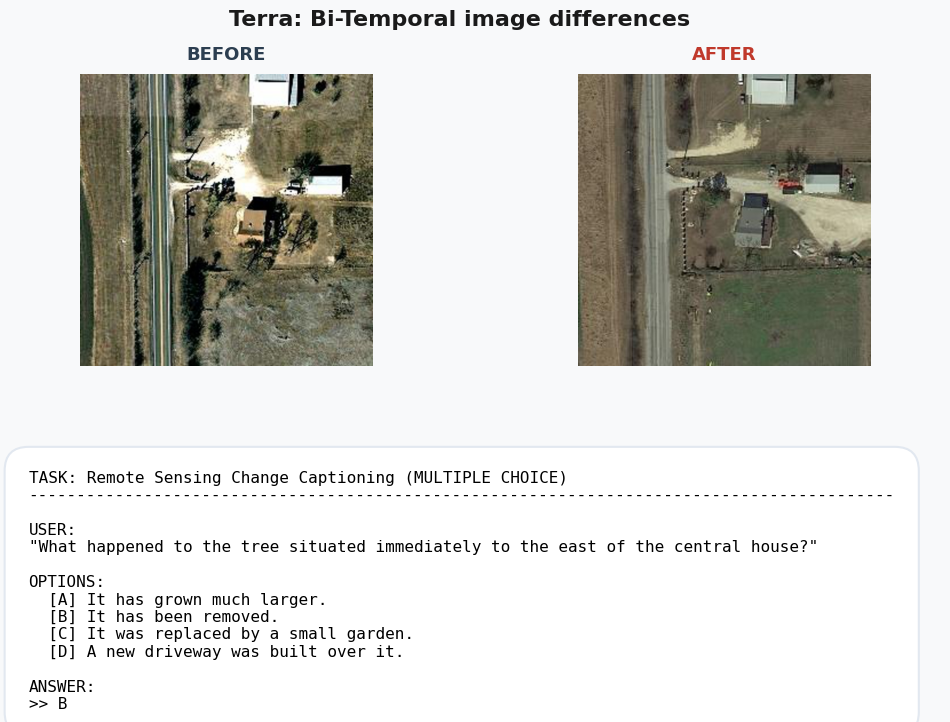

# Terra: Qwen3-VL LoRA fine-tuning on RSRCC



We fine-tuned the `Qwen/Qwen3-VL-4B-Instruct` VLMon the `google/RSRCC` dataset.
Small VLMs are excellent at describing a single image, but they struggle with
temporal and bi-temporal remote sensing tasks. When given two aerial images
taken at different times ($T_0$ and $T_1$), generic models often fail to capture
subtle differences, suffer from hallucinations, or confuse the chronological
order of events.

## Installation

Ensure you have [uv](https://github.com/astral-sh/uv) installed.

To install dependencies and prepare the virtual environment, run:

```bash
uv venv
source .venv/bin/activate  # On Windows, use `.venv\Scripts\activate`.
uv pip install -r pyproject.toml
```

## How to Run

To run the training pipeline, activate the environment and execute:

```bash
python src/train.py
```

To view the training progress and metrics in the MLflow UI, run:

```bash
mlflow ui --backend-store-uri sqlite:///mlflow.db
```

## License

Base model (Qwen3-VL 4B) and dataset (google/RSRCC) are licensed under
[Apache-2.0](https://www.apache.org/licenses/LICENSE-2.0) license.

This project ("Terra") is currently source available.
